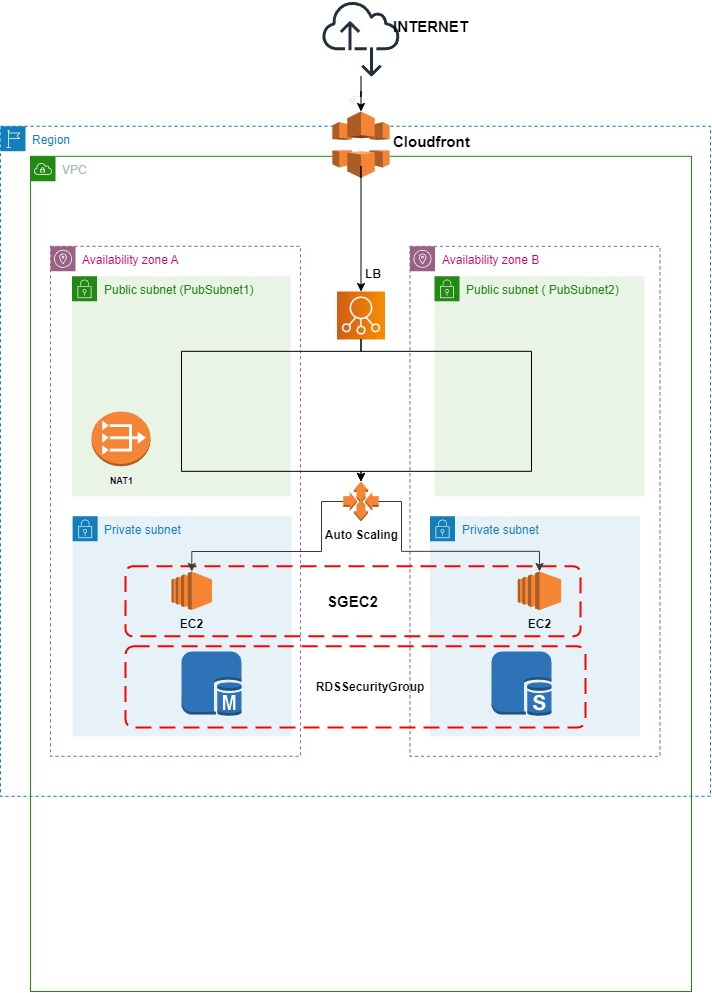

# AWS CloudFormation Template per go-to-live-kata

Questo template **AWS CloudFormation** permette di creare un'architettura ad alta disponibilità per il progetto "go-to-live-kata". L'architettura comprende una **VPC** con subnet pubbliche e private, un **bilanciamento del carico**, un **database RDS** e una **distribuzione CloudFront**.Infine, ho installato e configurato WordPress all'interno dell'ambiente, consentendo così la creazione e la gestione del nostro sito web in modo semplice ed efficace. Questa configurazione ci permette di concentrarci sul contenuto del nostro sito, sapendo che l'infrastruttura sottostante è altamente disponibile e sicura. 
## Architettura proposta

## Guida al Repository
Le risorse messe a disposizione nel repository:  
* *assets*: dove sono presenti i media utilizzati
* parameters *.json* per ogni template cloudformation: file json utilizzati per passare i parametri da AWS CLI . All' interno di ogni file sono presenti per ogni parametro dei valori di default assegnati ai ParameterValue , è necessario sostituire questi  valori se si vuole specificare un parametro. I valori di default sono gli stessi che si trovano seguendo l' approccio con console AWS.
*  *README.md*: file che si sta visualizzando
*  *vpc.yaml*: template yaml , imposta la VPC , le subnet, le route , la NAT, l ' Internet Gateway
*  *security-group.yaml*: template yaml , imposta i vari security group
*  *load-balancer.yaml*: template yaml , imposta il bilanciatore
*  *rds.yaml*: template yaml , imposta il database RDS utilizzato da wordpress
*  *ec2.yaml*: template yaml , imposta l' autoscaling delle EC2 e il launch config
*  *cloudfront.yaml*: template yaml, imposta cloudfront

## Parametri del Template  
Il template richiede alcuni parametri per configurare correttamente l'architettura,altrimenti verranno messi di default. Assicurati di fornire i seguenti parametri:
* `VPCCIDR`: Il CIDR per la VPC
* `PrvSubnet1CIDR` e `PrvSubnet2CIDR`: CIDR per le subnet private.
* `PubSubnet1CIDR` e `PubSubnet2CIDR`: CIDR per le subnet pubbliche.
* `WPV`: La versione di WordPress da utilizzare.
* `DBMAZ`: Abilita o disabilita Multi-AZ per il database (true o false).
* `StorageDB`: Dimensione del disco del database.
* `DBNAME`: Nome del database di WordPress.
* `USERNAME` e `PASSWORD`: Credenziali di accesso DB per WordPress.
* `PriceClassCloudFront`: Classe di prezzo per CloudFront.
* `NumeroDesEC2`: Numero di EC2 desiderato.
* `NumeroMaxEC2`: Numero di EC2 massimo.
* `NumeroMinEC2`: Numero di EC2 minimo.
## Come Creare lo Stack
### Dalla Console AWS

1. Accedi alla tua console **AWS**.
2. Naviga su **AWS CloudFormation**.
3. Clicca su "**Create Stack**".
4. Seleziona "**Template is ready**" e "**Upload a template file**", quindi fai clic su "**Choose file**" per selezionare il tuo file `vpc.yaml` dal tuo computer.
5. Fai clic su "**Next**".
6. Compila i parametri richiesti".
7. Fai clic su "**Next**".
8. Fornisci un nome per lo stack, ad esempio "VPC".
9. Fai clic su "**Next**" e continua a completare il processo di creazione dello stack.


Ripeti questa operazione con i restanti template in quest' ordine:
1. *security-group.yaml*
2. *load-balancer.yaml*
3. *rds.yaml*
4. *ec2.yaml*
5. *cloudfront.yaml*

Se desideri eliminare lo stack:
1. Seleziona lo stack che desideri eliminare.
2. Nella parte superiore della pagina dello stack, fai clic su "Delete".
3. Verrà visualizzata una finestra di conferma. Leggi attentamente le informazioni e, se sei certo di voler eliminare lo stack, clicca su "Delete stack".

Ripeti questa operazione con tutti gli stack rimanenti precedentemente creati
### Dalla AWS CLI

Assicurati di avere la **AWS CLI** installata e configurata sul tuo computer.
1. Scarica il Repository
```bash
git clone https://github.com/Mattt1108/go-to-live-kata.git
```
2. Entra nel repository clonato
```bash
cd go-to-live-kata/Parameters
```
3. Inserisci i parametri desiderati all' interno dei file json
4. Salgo di una cartella
 ```bash
cd .. 
```
5. Dai il permesso di esecuzione allo script `create_stack.sh`   
```bash
sudo chmod +x 
```
5. Lancia lo script `create_stack.sh` da terminale per creare gli stack
```bash
sudo ./create_stack.sh
```
6. Attendi la creazione dei vari stack

Se desidere eliminare uno stack e le relative risorse :
```bash
aws cloudformation delete-stack --stack-name NomeStack
```
## Avvio dell'Architettura  
Dopo aver creato con successo lo stack, puoi accedere alla console AWS e iniziare a configurare il tuo progetto .

Ricorda di seguire le best practice per la sicurezza e di eliminare lo stack quando non ne hai più bisogno per evitare costi inutili.

## Risorse Aggiuntive

### Documentazione AWS

- [Documentazione AWS ufficiale](https://docs.aws.amazon.com/)

### Contatti

Per ulteriori domande o assistenza, puoi contattarmi via email:

- Email: [matteo.lamalfa1108@gmail.com](mailto:tuo@email.com)
